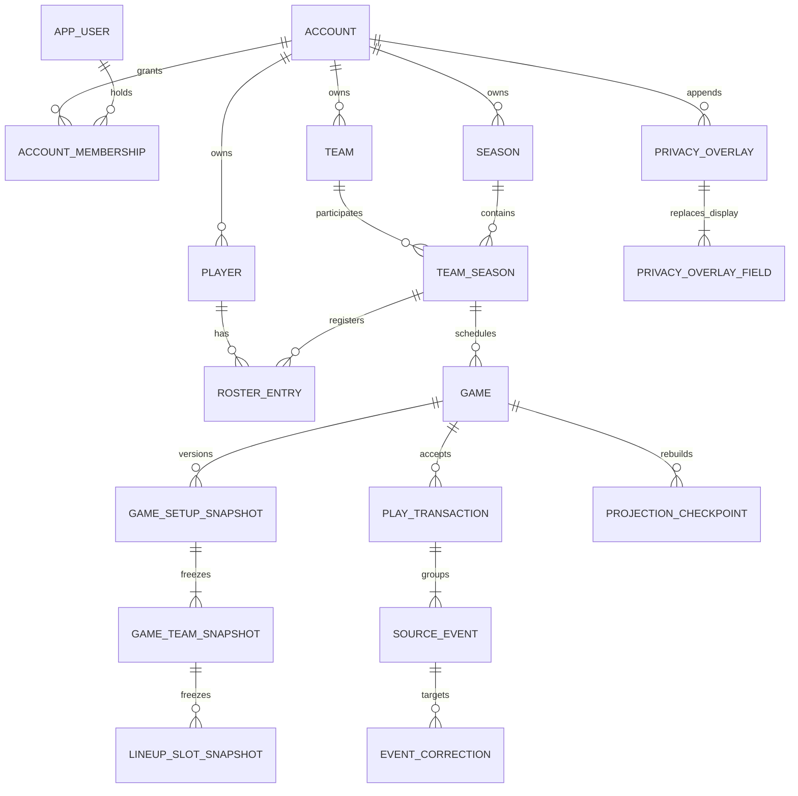

# Relational domain schema

Issue #9 implements the PostgreSQL/Prisma persistence structure required by the canonical scoring, tenancy, authorization, and privacy contracts. The Prisma schema and migration chain are the implementation authority for tables and database constraints; the canonical contracts remain authoritative for behavior and policy.

This is storage infrastructure, not a scoring service. Issue #10 owns typed event payloads, lifecycle transition enforcement, atomic acceptance, correction-graph validation, and replay. Issue #11 owns derived statistics. Issue #12 owns the broad scoring fixture suite.

## Relationship overview

Every account-owned row carries `accountId`. Critical child relations include `accountId` in composite foreign keys. IDs are globally stable, but an opaque ID alone is never a tenant or authorization check.

## Model catalog

All timestamps are server-written UTC timestamps. `Restrict` deletion is intentional unless noted; accepted history must not disappear through a cascade.

| Model                      | Purpose, ownership, and keys                                                                                                                                      | Lifecycle, deletion, and pseudonymization                                                                                                                                                                               | Authority and intended boundary                                                                                           |
| -------------------------- | ----------------------------------------------------------------------------------------------------------------------------------------------------------------- | ----------------------------------------------------------------------------------------------------------------------------------------------------------------------------------------------------------------------- | ------------------------------------------------------------------------------------------------------------------------- |
| `Account`                  | Tenant root. Global `id`; unique `slug`.                                                                                                                          | `ACTIVE`, `ARCHIVED`, `SUSPENDED`, or `PENDING_DELETION`; archive by default.                                                                                                                                           | Authorization/account service writes and reads. Authoritative.                                                            |
| `AppUser`                  | Application identity separate from login claims, membership, and players. Unique provider plus provider subject.                                                  | `ACTIVE`, `DISABLED`, `DELETED`, `MERGED`, or `RECOVERED`; detach mutable identity without deleting actor references.                                                                                                   | Future identity service. Authoritative identity reference.                                                                |
| `AccountMembership`        | Historical user-to-Account access relationship. Alternate key `(accountId,id)`.                                                                                   | `INVITED`, `ACTIVE`, `DISABLED`, or `REMOVED`; only one active membership per account/user, while terminal history permits reinvitation. Last-owner protection is transactional.                                        | Future authorization service. Authoritative.                                                                              |
| `MembershipInvitation`     | One-time invitation verifier plus immutable authority snapshot.                                                                                                   | `PENDING` then one terminal state: `ACCEPTED`, `EXPIRED`, `REVOKED`, or `SUPERSEDED`. Authority/recipient/verifier fields and terminal outcomes are immutable.                                                          | Future invitation service. Authoritative security data; never a baseball actor key.                                       |
| `MembershipRoleAssignment` | Baseline role at one exact Account, Team, Season, or Game scope.                                                                                                  | Active while `revokedAt` is null; revoked rows remain historical.                                                                                                                                                       | Future authorization service. Authoritative grant input.                                                                  |
| `CapabilityGrant`          | Named delegated capability at one exact scope, separate from roles.                                                                                               | Active while `revokedAt` is null; the same capability may be granted again after revocation.                                                                                                                            | Future authorization service. Authoritative grant input.                                                                  |
| `Team`                     | Stable Account-owned team identity reused across seasons. Alternate key `(accountId,id)`.                                                                         | `ACTIVE` or `ARCHIVED`; active display names are unique per Account, archived names may be reused.                                                                                                                      | Team management service (#13). Authoritative.                                                                             |
| `Season`                   | Account-owned competition/reporting period.                                                                                                                       | `DRAFT`, `ACTIVE`, `COMPLETED`, or `ARCHIVED`; dates must form a valid range.                                                                                                                                           | Season management service (#13). Authoritative.                                                                           |
| `TeamSeason`               | Domain join representing one team’s participation in one season. Unique `(accountId,teamId,seasonId)`.                                                            | Active from creation until `archivedAt`; a separate enum is unnecessary because participation has only active/archived states.                                                                                          | Team/season management service (#13). Authoritative.                                                                      |
| `Player`                   | Stable Account-owned baseball identity, never automatically an `AppUser`.                                                                                         | Active while `archivedAt` is null. Approved name changes after acceptance resolve through privacy overlays; historical snapshots stay unchanged.                                                                        | Roster management service (#13). Authoritative identity.                                                                  |
| `RosterEntry`              | One player’s roster period for one team-season, including period-specific jersey number.                                                                          | `ACTIVE`, `INACTIVE`, or `ARCHIVED`; multiple historical rows are allowed, with at most one active row per player/team-season.                                                                                          | Roster management service (#13). Authoritative participation.                                                             |
| `RulesetVersion`           | Immutable interpretation/configuration version referenced by accepted setup/events. Unique Account/name/version.                                                  | `ACTIVE` or `ARCHIVED`; a referenced version is never rewritten.                                                                                                                                                        | Ruleset administration; replay reads. Authoritative version input.                                                        |
| `Game`                     | Account-owned game shell and current operational lifecycle/revision. It belongs to the exact season of its managed team-season.                                   | Canonical states only: `DRAFT`, `READY`, `IN_PROGRESS`, `SUSPENDED`, `COMPLETED`, `VERIFIED`, `CORRECTED`, `ABANDONED`, `CANCELLED`. Hard deletion is limited to eligible never-started drafts without accepted events. | Game service (#14/#10). Current status is authoritative metadata reconciled with events.                                  |
| `GameSetupSnapshot`        | Immutable accepted setup revision with allowlisted schedule, location, innings, and ruleset fields. Unique game/setup revision.                                   | Append-only. A newer pregame revision supersedes by insertion, never mutation.                                                                                                                                          | Game setup service (#14); replay reads. Authoritative initial-state input.                                                |
| `GameTeamSnapshot`         | Immutable home/away side for one setup revision. One or both sides may reference exact Account team-seasons; external sides carry snapshot-only display identity. | Append-only. A team-season cannot occupy both sides, and each internal participant must belong to the game season; service acceptance requires both sides and inclusion of the Game's managed team.                     | Game setup service (#14); replay/reporting read. Authoritative snapshot.                                                  |
| `LineupSlotSnapshot`       | Immutable game-specific batting, defense, jersey, player/roster, and starting-pitcher assignment.                                                                 | Append-only. Defensive-only players may have no batting order. Internal slots require matching player/roster/team-season lineage; external slots cannot reference Account player identities.                            | Game setup service (#14); replay reads. Authoritative snapshot.                                                           |
| `PlayTransaction`          | Atomic accepted live-play boundary with exact setup, revisions, idempotency, payload hash, actor, and pre/post state hashes.                                      | Append-only after acceptance. Rejected proposals are not inserted as accepted transactions.                                                                                                                             | Event acceptance service (#10). Authoritative.                                                                            |
| `SourceEvent`              | Complete ordered event envelope, exact setup reference, and versioned JSON payload boundary.                                                                      | Append-only after acceptance. Sequence and standalone idempotency are unique; event/play setup identity is enforced by a composite foreign key.                                                                         | Event acceptance/replay (#10). Authoritative.                                                                             |
| `EventCorrection`          | Same-Account/same-game relation from a correction event to its target and a legacy replacement event or typed embedded replacement ID.                            | Append-only. Policy is `REPLACE_PLAY`, `REPLACE_EVENT_RANGE`, `REPLACE_JUDGMENT`, or `REVERSE_EVENTS`; graph acyclicity and embedded replacement payloads are validated by #10.                                         | Correction/replay service (#10/#15). Authoritative relationship.                                                          |
| `ProjectionCheckpoint`     | Rebuild metadata for a game or season projection, keyed by source, privacy-overlay, and derivation revisions.                                                     | `PENDING`, `BUILDING`, `CURRENT`, `FAILED`, or `STALE`; rows may be replaced/deleted because projections are derived.                                                                                                   | Statistic/projection worker (#11/later worker). Derived.                                                                  |
| `SecurityAuditRecord`      | Privileged/security action evidence, separate from baseball events. Account or system scope is explicit.                                                          | Append-only; retention/redaction policy is future operational work.                                                                                                                                                     | Authorization/privacy/operations services write; restricted audit readers consume. Authoritative audit evidence.          |
| `PrivacyOverlay`           | Account-scoped append-only privacy action with deterministic effective order and stable actor/correlation evidence.                                               | Append-only; no in-place “undo.” A later overlay records a later approved decision.                                                                                                                                     | Future privacy service writes; presentation/projection readers resolve. Authoritative display policy, not baseball state. |
| `PrivacyOverlayField`      | One allowlisted replacement display value targeting exactly one Player or historical lineup slot.                                                                 | Append-only with parent overlay. It never changes source revision or scoring meaning.                                                                                                                                   | Future privacy service/presentation boundary. Authoritative display policy.                                               |

Pitching appearances are represented by the accepted starting-pitcher setup plus ordered `PitchingChangeMade` source events. A mutable appearance table would compete with replayable history. Issue #10 types and validates those payloads; issue #11 may derive rebuildable appearance lines.

## Key and Account-isolation strategy

- Global primary IDs preserve actor and event references across archival or identity detachment.
- Every Account-owned model has an alternate `(accountId,id)` key where a child needs a tenant-scoped foreign key.
- `TeamSeason` supplies additional `(accountId,seasonId,id)` and `(accountId,teamId,id)` keys so a game and internal game side must match the exact season/team.
- Roster relationships include Account in both player and team-season foreign keys.
- Game setup, side, lineup, play, event, correction, projection, and privacy relationships use composite Account/game/snapshot keys where applicable.
- User identity is global, but current membership authorization is checked at every future protected operation. Email/contact values are never stable foreign keys.
- Security audits may be Account-scoped or system-scoped. Baseball records are never system-scoped.
- Cross-Account movement is prohibited; any future transfer/import design requires a new ADR and audited copy semantics.

## Constraint catalog

Prisma declares primary keys, composite foreign keys, ordinary unique constraints, enums, and indexes. Reviewed SQL migrations add invariants Prisma cannot express:

- valid season date ranges; positive setup innings; nonnegative game/projection revisions;
- exactly one active membership per Account/user;
- immutable invitation authority and terminal state with exactly one intended recipient form;
- exactly one active role or capability at the same exact scope;
- at most one home/away row, no duplicate internal participant, and same-season internal team participation;
- a separate nonnegative setup revision and exact ready-snapshot foreign key,
  without consuming the source-event revision;
- one active roster period per player/team-season, non-overlapping half-open
  membership periods, and nonnegative management revisions while historical
  periods remain;
- unique batting order, known player, roster entry, conventional defensive position, and starting pitcher per setup side;
- internal lineup player/roster/team-season lineage and snapshot-only external lineups;
- starting-pitcher assignments must use the pitcher position;
- atomic play revision, state-hash, component-order, and idempotency shape;
- positive ordered source-event sequence/version/revision fields and unique standalone idempotency;
- correction links remain same-game through composite foreign keys, use valid replacement/reversal shape, and cannot directly self-target;
- exactly one projection scope and revision identity;
- exactly one privacy-overlay field target;
- Account-versus-system audit scope;
- immutable primary identities, Account ownership, relationship endpoints, and referenced ruleset contents on otherwise mutable domain rows;
- update/delete prevention for accepted setup, play, event, correction, audit, and privacy rows.

Database constraints intentionally do not attempt current authorization, exactly-two-side transaction completion, batting eligibility, correction-graph acyclicity, sequence-gap policy, game transition legality, or event-payload interpretation. Those require the future service/replay transaction to inspect multiple accepted facts.

## Index catalog and access patterns

The schema avoids speculative report indexes and covers the issue #9 write/read paths:

- membership/invitation lookup by user, Account, status, and expiry;
- active role/capability lookup by membership and exact scope;
- teams, seasons, rulesets, and players by Account and lifecycle;
- team participation by Account/team or Account/season;
- active roster lookup by Account/team-season and player history by Account/player relation;
- games by Account/season/status and Account/team-season/schedule;
- setup sides and lineup players/roster entries by Account and immutable setup keys;
- source events by game/sequence, ruleset, timestamp, parent/transaction relation, and standalone idempotency;
- correction traversal by Account/game/target event;
- projection freshness by Account/scope/status and exact source/privacy/derivation revision;
- audits by Account/time, target, and correlation id;
- privacy overlay ordering and target resolution by Account/player or historical lineup slot.

Season-stat/reporting indexes are deferred until #11 exposes real query plans. Projection caches must include Account, source revision, privacy-overlay revision, and derivation version in identity.

## Authoritative and derived boundaries

Authoritative baseball input consists of stable Account/team/season/player/roster identities, accepted setup snapshots, play transactions, source events, and correction relationships. Accepted rows are append-only. `Game.status` and `Game.revision` are transactional current metadata and must reconcile with replay.

Projection checkpoints and future box scores/statistics are derived and rebuildable. They never authorize access and never replace events as source of truth. Privacy overlays affect approved display resolution and projection freshness, not event replay or baseball meaning.

The source-event payload remains JSON because event schema versions need an immutable serialized boundary. This is not permission for arbitrary metadata: issue #10 must validate a closed typed vocabulary, reject contacts/secrets/notes, compute the payload hash, and store only accepted payloads.

## Service-layer invariants

The database cannot safely enforce these multi-row or semantic rules by itself:

- exactly two accepted setup sides, inclusion of the Game's managed team-season, and a complete ruleset-valid starting lineup;
- all lifecycle transitions in the canonical scoring contract;
- current membership/capability authorization and last-owner protection;
- no event sequence gaps under the selected transactional allocation policy;
- one revision advance per standalone event or atomic play;
- full-play all-or-nothing validation and deterministic component ordering;
- correction dependency coverage, same effective revision, and acyclic graph;
- verified-game reopen/correct/reverify behavior;
- event payload allowlists and prohibition of personal/contact/note data;
- projection writer compare-and-swap so an older worker cannot overwrite newer output.

Issue #10 should expose narrow repository interfaces that can enforce these checks in one database transaction without update/delete methods for accepted events.

## Migration and representability policy

`20260729000000_relational_domain_schema` is the initial production schema. `20260729113000_relational_schema_hardening` is a forward-only follow-up that replaces over-broad roster uniqueness and tightens immutable lineup setup. `20260729170000_event_setup_reference` adds exact immutable setup references, an event/play setup-consistency key, a replay index, and stable embedded-replacement IDs required by deterministic event replay. `20260729200000_team_season_roster_management` adds optimistic revisions, player batting/throwing attributes, roster positions and half-open historical periods, a no-overlap exclusion constraint, and management query indexes. `20260729220000_game_lineup_pitching_setup` adds structured weather, separate setup revisioning, an exact ready-snapshot foreign key, and setup-submission evidence. `20260731131500_privacy_lifecycle` adds short-lived export artifacts, idempotent lifecycle requests, scoped holds, terminal-state checks, and one-active-request-per-target enforcement. `20260731140000_rate_limits_abuse_quotas` adds database-authoritative Account and actor counters, idempotent quota charges, and expiring audited overrides. `20260731150000_public_api_external_ids` adds database-generated, immutable UUID identifiers for the versioned read API without replacing internal relationship keys. `20260731163523_durable_webhooks` adds Account-scoped endpoints, immutable versioned outbox events, ordered leased deliveries, replay attempts, lifecycle constraints, and retention indexes. `20260731173000_product_analytics_consent` adds the current user-level, expiring opt-in or opt-out preference without storing product-event payloads. `20260731190000_external_ingestion` adds approved provider sources, idempotent checkpointed runs, immutable versioned records, correction lineage, and Account-scoped quarantine. `20260731213000_calendar_sync` adds Account-scoped calendar connections, leased synchronization state, deterministic provider-event links, version-aware conflicts, and recoverable disconnect lifecycle. `20260731223000_outbound_notifications` adds Account- and team-scoped recipient rules, managed destination references, shared-event email/Discord deliveries, leased retries, durable attempts, opt-out cancellation, and dead-letter retention. `20260731230000_discord_settings_contract` separates immutable Discord installation/channel identity from versioned editable settings and adds tenant-safe team-season and destination routing references. `20260731233000_discord_permissions` adds immutable server-managed guild role identities, versioned action grants, tenant-safe role/install relationships, and active-grant lifecycle guards. `20260801034000_supabase_security_hardening` fixes repository function resolution, removes direct API-role execution from trigger and constraint helpers, and moves `btree_gist` objects out of the API-exposed public schema. Applied production migrations are never edited.

`20260801040000_discord_channel_routing` expands Discord destinations to six
administrator-facing categories and records independently reviewable channel
enablement and live View/Send permission evidence.

`20260801050000_discord_update_cadence` adds bounded event, interval, manual,
and digest scheduling policy; explicit pause/catch-up state; coalesced manual
requests; worker status timestamps; and a partial due-evaluation index.

The issue #9 hardening migration is metadata/index/trigger-only and performs no lossy conversion. Existing duplicate lineup assignments cause index creation to fail visibly rather than silently choose a winner. The issue #10 setup backfill resolves a source event only when exactly one setup for its Account/game carries the recorded ruleset; a transaction inherits one consistent component setup, or the sole game setup when it has no events. Missing or ambiguous attribution aborts. The issue #13 roster backfill derives period starts from creation time and terminal ends from archival/update time without modifying accepted setup or event history. The issue #14 backfill points each operational game at its highest setup revision and aborts if no setup is attributable. Deployment preflight must therefore query duplicate lineup assignments, games with repeated setup/ruleset combinations, unmatched events, transactions with inconsistent component setup, invalid roster status/end combinations, overlapping player/team-season periods, and operational games without an intended highest ready setup. Rollback after data exists is roll-forward repair. Dropping the new constraints would re-admit invalid writes and is not a safe operational rollback.

CI applies the complete migration chain to empty disposable PostgreSQL, verifies migration status/catalog objects, then runs a transaction-scoped synthetic representability proof. The proof rolls back all fixture rows and demonstrates:

- two Accounts and structural rejection of a cross-Account roster link;
- rejection of cross-Account movement and historical roster-identity rewrites;
- multiple teams in one Account;
- one team across multiple seasons;
- one stable player across seasons and teams;
- multiple historical roster periods and jersey numbers with one active-period limit;
- home/away participants including two Account-managed opponents, external-opponent support, starting batting/defensive lineups, and starting pitchers;
- ordered substitution, defensive-position, multiple pitching-change, and extra-inning event envelopes;
- an append-only correction relation;
- a setup snapshot and privacy overlay that leaves accepted display history unchanged;
- projection metadata tied to source and privacy revisions;
- rejection of duplicate lineup player/position and mismatched internal/external identity.

This is schema representability proof, not issue #12’s scoring-correctness fixture suite.

## Privacy and data minimization

The schema stores a player display name and period-specific roster jersey number. It contains no date of birth, birth year, age band, player/parent contact information, medical/injury/behavioral/family fields, or free-form player notes. Invitation delivery contact is adult access-delivery data and never enters baseball snapshots/events.

Privacy overlays hold only allowlisted replacement display values, targets, reason code, actor/correlation metadata, and effective order. They do not duplicate raw event payloads or mutate snapshots, player IDs, jersey/baseball facts, rulesets, event order, or scoring meaning.

## Acceptance mapping and deferrals

| Issue #9 acceptance criterion                                                   | Evidence                                                                                                                                            |
| ------------------------------------------------------------------------------- | --------------------------------------------------------------------------------------------------------------------------------------------------- |
| Relationships, keys, constraints, indexes, and lifecycle states are documented. | Model, key, lifecycle, constraint, index, deletion, writer/reader, and service-invariant catalogs above; Prisma schema and two reviewed migrations. |
| Multiple teams and seasons without duplicated identities.                       | Stable `Team`/`Player`, domain `TeamSeason`/`RosterEntry`, historical roster-period uniqueness, and transactional synthetic proof.                  |
| Representative games without lossy fields.                                      | Immutable setup/side/lineup snapshots plus complete event/correction/projection envelopes and PostgreSQL representability proof.                    |

Explicitly deferred:

- #10: event payload schemas, transition errors, idempotent acceptance repository, deterministic replay, correction graph, and concurrency behavior;
- #11: batting/pitching/fielding/team derivation and projection writes;
- #12: integrated scoring fixtures, intermediate inning assertions, box scores, and player lines;
- #15: correction, audit, replay, and report-version application workflow;
- later privacy/auth/operations work: middleware, privacy actions, exports, retention jobs, backups, and public sharing.
